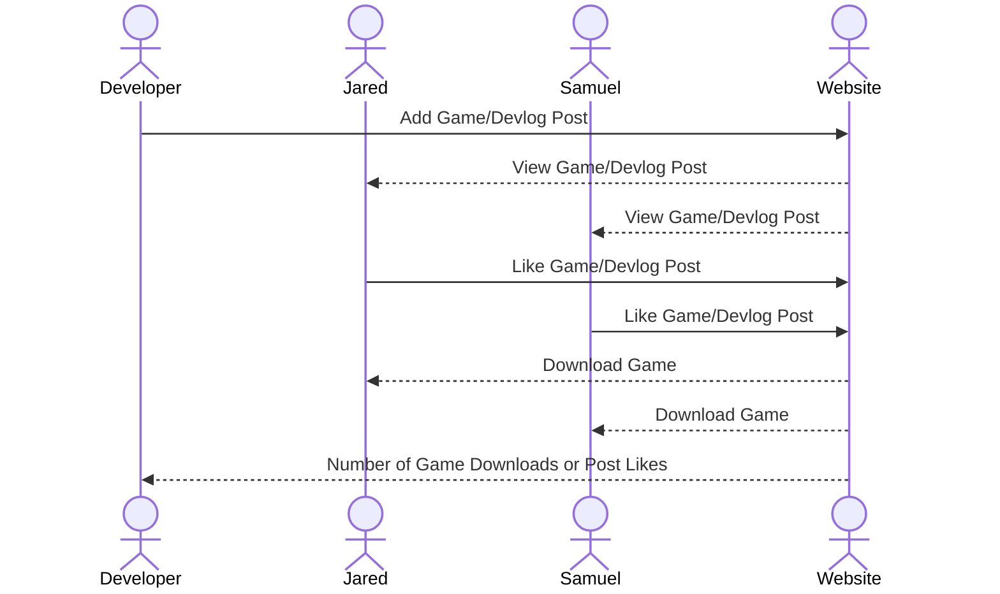

# TN-Games (Game Development Website)

[My Notes](notes.md)

This application serves as both a developer log and a place where I can feature games I have created. People can go on the application and read the devlogs and download games that I have created and released onto their computer. The site can also double as a portfolio where I can send employers to look at my works.

## 🚀 Specification Deliverable

For this deliverable I did the following. I checked the box `[x]` and added a description for things I completed.

- [x] Proper use of Markdown
- [x] A concise and compelling elevator pitch
- [x] Description of key features
- [x] Description of how you will use each technology
- [x] One or more rough sketches of your application. Images must be embedded in this file using Markdown image references.

### Elevator pitch

Whenever I am making a game or some other project, it would be nice to have somewhere to put it for people to easily see it. This application is designed to be a hub for games that I create and release onto the internet. It is also designed to have a devlog where I can write about stuff that I am doing and also announce games on. Users will be able to log into the website and read the devlogs and like both posts or games. They will also be able to go to the games page and install my games (or redirect to a website where they can install it). I will also be able to log in to the site and be able to add new posts or create a new page for a game.

### Design

Website Design sketches (Subject to change)

Sequence Diagram on how the website interacts with its users

### Key features

- ***Home Page*** where users can see the latest announcement and redirect to other pages
- ***Devlog Page*** where users can view and like posts that I release
- ***Game Page*** where users can view, favorite, and install games
- Both **Game** and **Devlog** pages have the ability to show the amount of likes/favorites on each post
- Secure ***User Login Page*** for users
- Seprate, secure ***Developer Login Page*** so I can login with the ability to add posts
- Ability for me (The developer) to create new devlog posts and game pages without having to mess with the code

### Technologies

I am going to use the required technologies in the following ways.

- **HTML** - The basic structure for the website. Uses 5 HTML pages. Pages are, Home, Devlog, Games, User Login, and Developer Login. Uses Hyperlinks to connect all of the pages together.
- **CSS** - Create the style for the website. Such as where all the boxes goes and the size of images.
- **React** - Provides login, post, applying likes/favorites, display likes/favorites, game install, and backend endpoint calls. Reacts to user actions on site.
- **Service** - Backend service with endpoints for:
    - retrieving game files
    - retrieving post info
    - submitting likes or favorites
    - submitting new posts or games
    - displaying a random geek joke from https://geek-jokes.sameerkumar.website/api?format=json
- **DB/Login** - Stores game files and post data, devlog post data, and likes/favorites in database. Also stores user and developer data securely in the database. Users must be authenticated to like or favorite posts, but not to install games.
- **WebSocket** - Posts are brodcast to other users when submitted by the Developer. Likes and favorites are also brodcasted when a user presses the button

## 🚀 AWS deliverable

For this deliverable I did the following. I checked the box `[x]` and added a description for things I completed.

- [x] **Server deployed and accessible with custom domain name** - [My server link](https://startup.tn-games.com).

## 🚀 HTML deliverable

For this deliverable I did the following. I checked the box `[x]` and added a description for things I completed.

- [x] **HTML pages** - I created four HTML Pages, `index.html` (Home page), `devlog.html`, `games.html`, and `login.html`.
- [x] **Proper HTML element usage** - I used HTML tags such as HEADER, BODY, NAV, MAIN, etc. to help create my website.
- [x] **Links** - I created links between all of my pages.
- [x] **Text** - Most of my pages have text such as the home page or the devlog page in order to give the user informaton about the page.
- [x] **3rd party API placeholder** - `index.html` has a place on the footer to display a geek joke.
- [x] **Images** - Image is on every page.
- [x] **Login placeholder** - Placeholder for authentication is on the `login.html` page. Links to the page also double as a username display.
- [x] **DB data placeholder** - Game post is on `games.html` and Devlog post is on `devlog.html`.
- [x] **WebSocket placeholder** - The posts have buttons on them for like, favorite, and downloads that will be updated in real time. New posts are also updated in real time.

## 🚀 CSS deliverable

For this deliverable I did the following. I checked the box `[x]` and added a description for things I completed.

- [x] **Header, footer, and main content body** - I used the CSS file `main.css` to style the basic page style. Specific styling are in the `home.css`, `devlog.css`, `games.css`, and `login.css` files.
- [x] **Navigation elements** - Used Bootstrap to style the navigation buttons.
- [x] **Responsive to window resizing** - All pages respond to window resizing using `display:flex;` and other flex features.
- [x] **Application elements** - Used flex to align everything in the correct place.
- [x] **Application text content** - The main text are in `Courier New`, but there are several other fonts and sizes for different text.
- [x] **Application images** - Resized images to fit with the rest of the page.

## 🚀 React part 1: Routing deliverable

For this deliverable I did the following. I checked the box `[x]` and added a description for things I completed.

- [ ] **Bundled using Vite** - I did not complete this part of the deliverable.
- [ ] **Components** - I did not complete this part of the deliverable.
- [ ] **Router** - Routing between login and voting components.

## 🚀 React part 2: Reactivity

For this deliverable I did the following. I checked the box `[x]` and added a description for things I completed.

- [ ] **All functionality implemented or mocked out** - I did not complete this part of the deliverable.
- [ ] **Hooks** - I did not complete this part of the deliverable.

## 🚀 Service deliverable

For this deliverable I did the following. I checked the box `[x]` and added a description for things I completed.

- [ ] **Node.js/Express HTTP service** - I did not complete this part of the deliverable.
- [ ] **Static middleware for frontend** - I did not complete this part of the deliverable.
- [ ] **Calls to third party endpoints** - I did not complete this part of the deliverable.
- [ ] **Backend service endpoints** - I did not complete this part of the deliverable.
- [ ] **Frontend calls service endpoints** - I did not complete this part of the deliverable.

## 🚀 DB/Login deliverable

For this deliverable I did the following. I checked the box `[x]` and added a description for things I completed.

- [ ] **User registration** - I did not complete this part of the deliverable.
- [ ] **User login and logout** - I did not complete this part of the deliverable.
- [ ] **Stores data in MongoDB** - I did not complete this part of the deliverable.
- [ ] **Stores credentials in MongoDB** - I did not complete this part of the deliverable.
- [ ] **Restricts functionality based on authentication** - I did not complete this part of the deliverable.

## 🚀 WebSocket deliverable

For this deliverable I did the following. I checked the box `[x]` and added a description for things I completed.

- [ ] **Backend listens for WebSocket connection** - I did not complete this part of the deliverable.
- [ ] **Frontend makes WebSocket connection** - I did not complete this part of the deliverable.
- [ ] **Data sent over WebSocket connection** - I did not complete this part of the deliverable.
- [ ] **WebSocket data displayed** - I did not complete this part of the deliverable.
- [ ] **Application is fully functional** - I did not complete this part of the deliverable.
